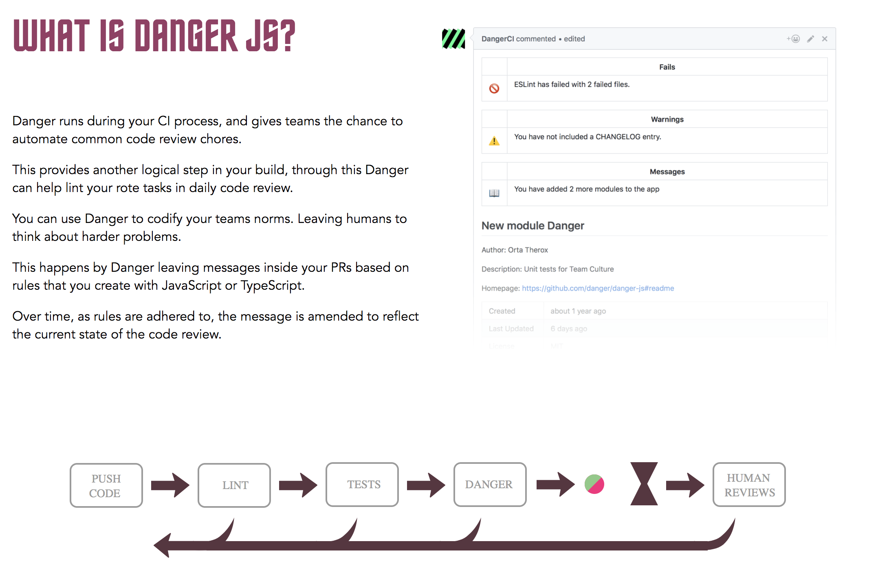

# Taiichi


Taiichi is a collection of danger plugins used at BAM.

## Danger in one paragraph

Danger is a tools created by @orta and living on [danger/danger-js](https://github.com/danger/danger-js) github.

It is sucessfully used by big companies to provides quality by helping the reviewer find nasty errors and thus making able to focus more on the content of the PR.



When you will use it on your repository, you will get a comment by danger:


## How is it structured

### Plugins

Taiichi is nothing more that a collection of node packages:

* [@bam.tech/danger-plugin-eslint](https://www.npmjs.com/package/@bam.tech/danger-plugin-eslint)
* [@bam.tech/danger-plugin-flow](https://www.npmjs.com/package/@bam.tech/danger-plugin-flow)
* [@bam.tech/danger-plugin-todo](https://www.npmjs.com/package/@bam.tech/danger-plugin-todo)

You can use like this:

```js
// dangerfile.js
import { schedule } from "danger";
import todo from "@bam.tech/danger-plugin-todo";

schedule(todo());
```

### Config

In the near future, a centralised config will exist that will provide sane default to plugins and allow you to upgrade the config without upgrading each plugins and adding new plugins.

## How to contribute

Danger is deployed with semantic release under @bam.tech organisation. So, once added to bam organisation, deployement is just:

```bash
cd <ROOT_OF_THE_PROJECT>
yarn install
git add -p
git cz
yarn run semantic-release
```

The code itself is organized into lerna package in packages file.

For instance, we take eslint package into example.


The structure can be generated by using `generator-danger-plugin` yoman generator.


The key points is:

* only provide relevant information (so for instance filter by modified/ created files)
* be short in the information that appears in summary
* provide details in spoiler
* try to give at least:
  * the why: why the error is important ?
  * the what: what files have what error ?
  * the how: a link to a standard
  * the who: who is responsible of this ? If I don't agree, who shall I go to complain.
